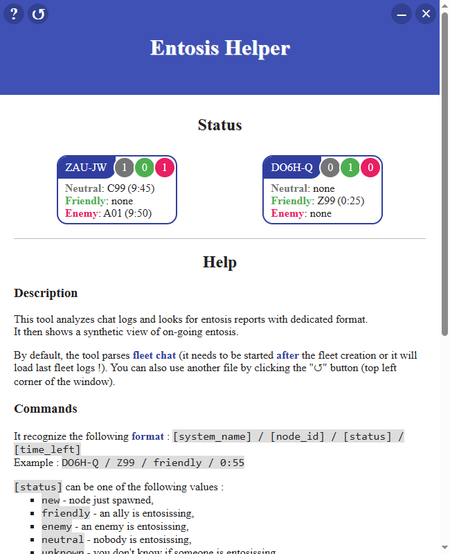

# entosis-helper

This tool analyzes EvE Online chat logs and looks for entosis reports with dedicated format.
It then shows a synthetic view of on-going entosis.



## Usage

By default, the tool parses fleet chat (it needs to be started after the fleet creation or it will load last fleet logs !). You can also use another file by clicking the "↺" button (top left corner of the window).

It recognize the following format : `[system_name] / [node_id] / [status] / [time_left]`, for example:
* `DO6H-Q / Z99 / friendly / 10:00`
* `ZAU-JW / P21 / enemy / 0:55`
* `1M4-FK / A01 / neutral / none`

### System

The `[system]` is obviously the name of the system where the node is located (reminder: all nodes spawn in the same constellation).

### Node id

The `[node_id]` is the last part of a command node name which helps differentiating several ndoes in the same system.  
To be clear, all nodes are named with the following convention: `[system] Infrastructure Hub Command Node [node_id]`, where `[system]` is the name of the system for which the entosis event is running (⚠️ it is _not_ the node id) and the very last part of the name is the actual node id. It always starts with a letter followed by two digits for a total of three characters.  
So, for example, in the name `ZAU-JW Infrastructure Hub Command Node B58`, the node id is `B58`.

### Status

`[status]` can be one of the following values :
* `new` - node just spawned,
* `friendly` - an ally is entosissing,
* `enemy` - an enemy is entosissing,
* `neutral` - nobody is entosissing,
* `unknown` - you don't know if someone is entosissing.
Note that "new", "neutral" and "unknown" are considered the same and are shown as "neutral". You can use either command as you prefer.

### Timer

`[time_left]` must follow a strict format : `[minutes]:[seconds]`.  
* ... but you can also use the `warmup` keyword instead of a timer.
* ... or the `done` keyword to indicate the node is gone.
* ... and for neutral nodes, use the `none` keyword (or the other too will work too - there is no timer for neutral nodes anyway).

## Tips and tricks

I highly recommand you to **drag and drop the system name** instead of writting it manually.
Even if the application tries to infer your input in case of typo, it is not really reliable. Drag and drop will be faster than wrtting the full name anyway.

The tool selects the last fleet file by default. If you have several characters logged-in in different fleets, make sure to double-check as Murphy law says that you will never get the right one !

You can click on a system name to show or hide nodes details.

Commands are not case sensitive.

## Contact

- Ryanis (in game name)
- ryanis.shadow@gmail.com (email)

## For developers

You need a modern version of [nodejs](https://nodejs.org) to build the application.

It uses [Electron](https://www.electronjs.org/) and [VueJS](https://vuejs.org/) under the hood.  
You may want to familiarize with their documentations and especially the tutorials since they are not excatly _straightforward_.

Install dependencies first:
```bash
npm install
```

To run a local development build (where renderer changes are updated live, but not the main process code):
```bash
npm start
```

To Package the application into a deliverable ZIP file:
```bash
npm run make
```
NB: the `npm run package` command is similar, except it builds a portable version of the applicaiton without bundling it into a ZUP file.
